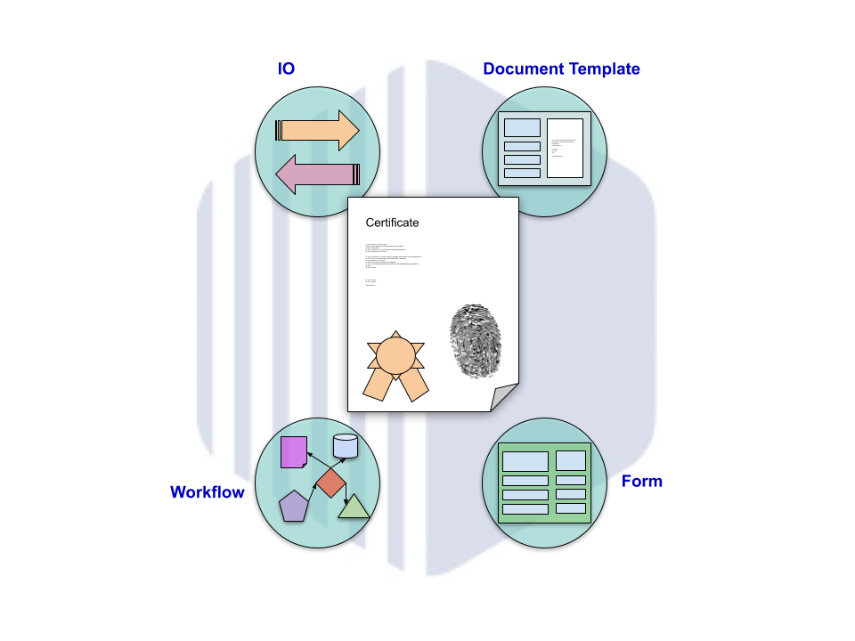

Proxeus
----------------
Main repository of the proxeus platform.

## 1. Getting Started
This section describes how to build and run the platform for developers.

### 1.1 Install Prerequisites:
#### Prerequisites:
+ make
+ go (1.10+, 64bit for Windows)
+ GOBIN added to your PATH (to check your GOBIN: `echo $(go env GOPATH)/bin`)
+ curl
+ yarn (1.12.3+)
+ node (8.11.3+, node v12 is incompatible)
+ vue-cli
+ git

#### Install Prerequisites:
```
sudo apt-get install make golang curl npm git
```

### 1.2 export PATH variables
```
PATH=$PATH:$(go env GOPATH)/bin
```

### 1.2 Get repository
Get repository and change into new directory:
```
git clone git@git.proxeus.com:core/central.git $(go env GOPATH)/src/git.proxeus.com/core/central
cd $(go env GOPATH)/src/git.proxeus.com/core/central
```

### 1.3 Build
All the build projects are stated in `./Makefile`.

First to initialize dependencies run:
```
make init
```

Build `server` and `ui`:
```
make all
```

### 1.4 Start
Run `server`
```
./artifacts/server
```

### 1.5 Configure platform
#### Configure settings
Open `http://localhost:1323/init` and configure settings.

##### Suggested settings

###### Document Service URL
```
https://dev-ds.proxeus.com/
```

###### Blockchain contract address (ropsten)
```
0x1d3e5c81bf4bc60d41a8fbbb3d1bae6f03a75f71
```
(alternatively deploy own smart contract from ProxeusFS.sol)

###### Email from
```
no-reply@proxeus.com
```
###### sparkpost api key
```
bd0bd90433c7af6d6c8f69eab6c3d6fd1bbd5df4
```
(alternatively setup a free account on https://www.sparkpost.com)

###### Initial Email
Set new email for root user and choose a secure password
```
admin@proxeus.com
```

#### Configure internationalization
login with newly created user and in the left menu navigate to `Internationalization` (`http://localhost:1323/admin/i18n`). 
Add `en` as a language and save.

## 2 Tests
### Run all tests 
```
make tests
```

### Update mocks
install the gomock package and the mockgen tool:
```
go install github.com/golang/mock/mockgen
```

Generate Mocks
(mocks have to be same package and path as original class, else there are issues with imports)
```
mockgen -package storm -source sys/db/storm/workflow_payments.go --destination sys/db/storm/workflow_payments_mock.go
mockgen -package storm -source sys/db/storm/user.go --destination sys/db/storm/user_mock.go
mockgen -package storm -source sys/db/storm/workflow.go --destination sys/db/storm/workflow_mock.go
mockgen -package blockchain -source main/handlers/blockchain/adapter.go --destination  main/handlers/blockchain/adapter_mock.go
```


## 3 Misc

### 3.1 Setup with docker
TODO: not available for now, only when docker images are publicly accessible

In order to run the platform it is alternatively possible to start the platform in docker containers.
Note: To build `platform` docker image on host running on non-linux environment a separate cross compiler must be used.

Requirements: docker, docker-compose
Start docker containers:
```
docker-compose up -d
```
When starting the platform for the first time please proceed by following the instructions in `1.5 Configure platform`.

### 3.2 UI
For more info check the [UI Readme](ui/README.md).

#### Building for Production
```
make ui
```
#### Building for Development (with hot-reloading)
```
make ui-dev
```

### 3.3 XES-Payment
For more info check the [XES-Payment Readme](docs/xes-payment.md).

### 3.4 Smart contracts & Solidity
For more info check the [Smart contracts & Solidity Readme](lib/wallet/README.md).

<!---
## API's

Workflow...:

coming soon....
-->


<!---
## Introduction

Text about Proxeus coming soon!


Table with API documentation of workflow, form and doc-template coming soon!

| Component    | Description |
|:----------:|-------------|
| **`Workflow`** | Our main Ethereum CLI client. It is the entry point into the Ethereum network (main-, test- or private net), capable of running as a full node (default), archive node (retaining all historical state) or a light node (retrieving data live). It can be used by other processes as a gateway into the Ethereum network via JSON RPC endpoints exposed on top of HTTP, WebSocket and/or IPC transports. `geth --help` and the [CLI Wiki page](https://github.com/ethereum/go-ethereum/wiki/Command-Line-Options) for command line options. |
| **`Form`** | Source code generator to convert Ethereum contract definitions into easy to use, compile-time type-safe Go packages. It operates on plain [Ethereum contract ABIs](https://github.com/ethereum/wiki/wiki/Ethereum-Contract-ABI) with expanded functionality if the contract bytecode is also available. However, it also accepts Solidity source files, making development much more streamlined. Please see our [Native DApps](https://github.com/ethereum/go-ethereum/wiki/Native-DApps:-Go-bindings-to-Ethereum-contracts) wiki page for details. |
| **`Document Template`** | Stripped down version of our Ethereum client implementation that only takes part in the network node discovery protocol, but does not run any of the higher level application protocols. It can be used as a lightweight bootstrap node to aid in finding peers in private networks. |
| **`IO`** | Brings all Proxeus elements together and further more it brings together other services or systems by providing a data IO interface. This interface makes it possible to implement connections to other services. By making this connection available in Proxeus, we can use the toolset of Proxeus for  |
-->
