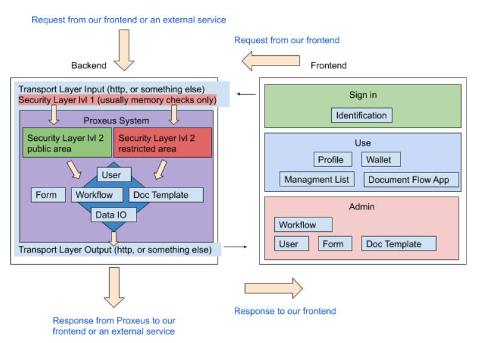

# Architecture

## High level overview

### Backend

- **Tansport Layer IO**: Does not necessarily need to be http

- **Security Layer lvl 1**: Is checking on the session the authority. Usually it is only accessing the memory but in case of a restart, the session will be loaded from the disk when it is requested by this layer.

- **Proxeus System**: The idea of the system is to be compatible with all operating systems and devices. Besides that, it needs to encapsulate the logic from the transport layer to be protocol independent.
    - **Security Layer lvl 2**: Is providing an authority object to the system with which the system is able to check on memory or disk to decide whether the call is valid or not. The validity check is implemented in each of the entities like User, Form, Workflow… 
    - **User**: A User can be an anonymous user only identified by his blockchain address or a user that shares more about his identity. The user can choose for himself in his profile settings. If he is an anonymous user and is executing a process that needs more information about himself, he can’t proceed until he provides everything that is needed. 
    - **Form**:  Form on the backend is only taking care of the validation that was specified on the frontend.

The backend communicates with the document service to generate documents from a template and a JSON.
Please refer to the document-service's documentation for more information.

### Frontend
- **Sign in**
    - **Identification**: The user is identified by his blockchain address or username and password.
    
- **User**
    - **Profile**: The user can change his profile and privacy settings. The user can choose in his privacy settings to be found by other Proxeus users. This way others can identify a specific user easier and they can share content with him.

- **Admin**
    - **Workflow**: Define a workflow for the document flow app.
    - **User**: Invite a user or change settings.
    - **Form**: Define the UI form and validation of the fields.
    - **Doc Template**: Create document templates.

