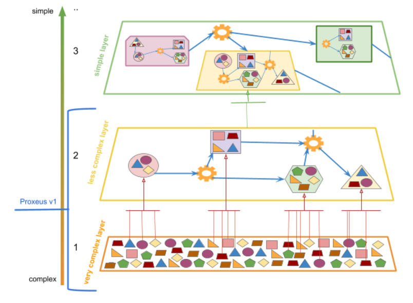
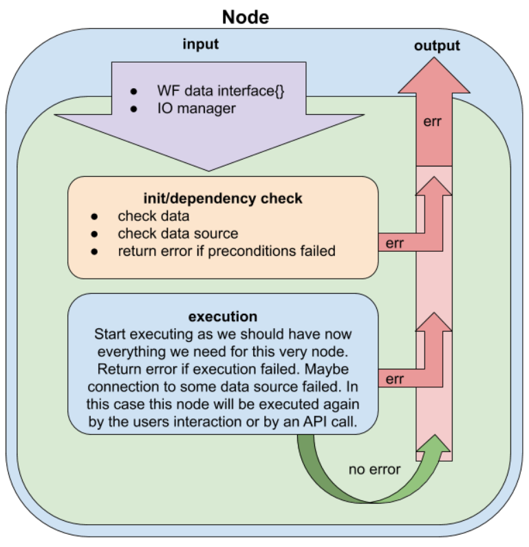
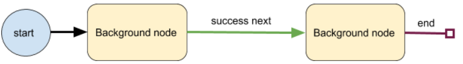
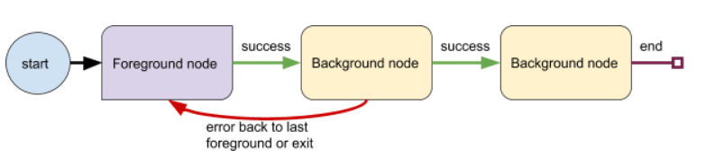
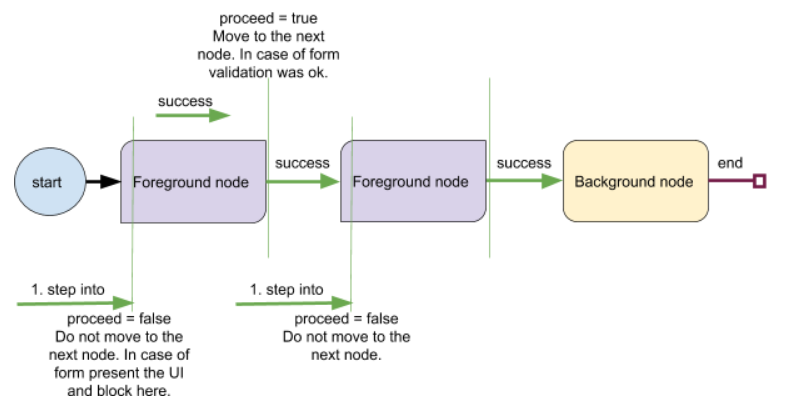
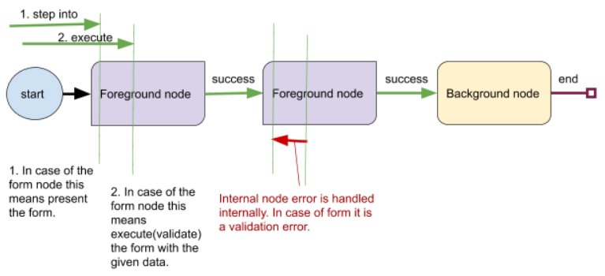
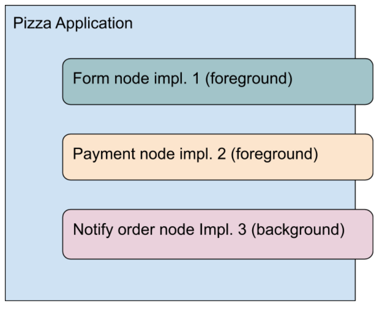

# Backend

## Workflow

The idea of the workflow is to be able to handle the flow of logic pieces that are well designed to be reused. This way we gain performance in building processes and we simplify complex procedures. It enables layered programming by design.

### Workflow nodes

#### Background node

A background node is not blocking the process.

When you call Next(), you get a background node with Current() if it is a node at the end of the workflow otherwise you will get a foreground node if no error occurred.

In the background nodes implementation, there should be always returned < proceed > true if no error occurred otherwise it is configured wrong.
Execute() is called once if no error occurred.

Background nodes can be skipped in the Previous call to be able to get back to the last foreground node if no error occurs.

Please note, there is no detection for wrong configuration of background nodes during runtime.

If your node implementation changes and has an effect on the execution type, you must keep the background flag consistent.

#### Foreground node

A foreground node is blocking the process.

When you call Next(), usually you should get the foreground node by calling Current(). 
Foreground nodes have states in the node implementation that causes Execute() to be called more than once.

For example a form node. It has at least two states. State one is presenting the form, state two or higher is validating the form.

#### Internal node

There are two internal nodes workflow and condition.

These nodes are handled by the engine itself, they are visible in the Stack but they can also be visible in Current().
For example if the root workflow starts with another workflow or a condition.

#### Background node

Successful execution of background node proceeds to the next one without waiting.

Error when executing a background node. The entire workflow process stops or moves back to the foreground node and waits for the next user interaction.

#### Foreground node

Successful execution of foreground nodes.

Internal errors are handled completely inside the node. The workflow layer knows whether it was processed or not and receives the internal error to propagate.

#### Recursion

`Execute(node *Node) (proceed bool, err error)`

Execute is being called when the node becomes the current target, doesn't matter whether it goes forward or backward.
If the node was executed before and returned proceed = false, the same instance is being used again.

`Remove(node *Node)`

Remove is being called when this node is not part of the path anymore. In other words, when it doesn't exist in the State

`Close()`

Close will be called on the instance before the next node is being executed or when the end is reached

Close is always the last called method either Execute()* -> Close() OR Execute()* -> Remove() -> Close().

Execute() can be called n times before Close() or Remove() as it is controlled by the node impl.
When it is called, the instance is released from the engine.

#### Workflow example usage

Our Pizza application is being initialized as a user would like to order n Pizza’s.

1. The user starts to choose the Pizza’s he likes and provides his address.
2. The user pays for his order.
3. A notification is being sent to the Pizza restaurant with the order.

Application:

It keeps all the instance specific things we need for node executions and everything else. Like caller, database access and other states. The responsibility of the application context is to provide a meaningful environment for node executions.

Node implementations:

In most cases, we need to have a reference of the application instance in the node, so we can change the memory state of the instance, access a database or similar. That’s why we can provide a function that initializes our node implementation at runtime. This way, we can structure the implementations how every we need to.

