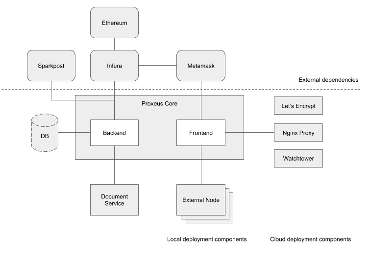

# Components

## Components

To deploy Proxeus on your infrastructure, you need to deploy the following 
components:

* Proxeus Core: the frontend and the Backend
* Document Service: responsible of document templating and formatting
* External Nodes: extensions to augment Proxeus workflow capabilities
* Database: optional external database

In addition, our cloud deployment uses the following components:
* Nginx Proxy: TLS termination
* Let's Encrypt: TLS certificate management
* Watchtower: automated docker containers update

## External Dependencies

Proxeus uses the following external dependencies:

* [Infura](https://infura.io/): Ethereum node as a service. Please follow the [Geth](https://github.com/ethereum/go-ethereum/wiki/Command-Line-Options) or [Parity](https://wiki.parity.io/Parity-Ethereum) documentation for more information.
* [SparkPost](https://www.sparkpost.com/): Email provider
* [Metamask](https://metamask.io/): Browser wallet for authentication, signature and payment.
