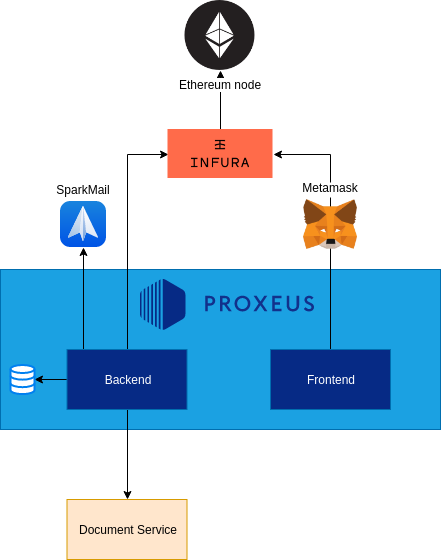

# Components

By splitting Proxeus we can clearly show the different components that makes it what it is:

Part of this repository:
- **Backend**, which exposes an HTTP API. 
    - with a Storage
- **Frontend**, which communicates with the above API

External services:
- **Document-Service**
- **Infura/Ethereum**
- **Metamask**
- **SparkPost**

## Backend
An HTTP listener with business logic on it. Other than APIs, serves also the html pages from the frontend.
Has an open connection to an Ethereum node to register a document hash, signing documents and detect workflow payments.

### Storage
The backend stores some data like:

- Settings
- Users
- Workflows

into files. The location is configurable on first launch or from the super user under the Settings section.

## Frontend
The frontend communicates with the backend's API and to Ethereum through [Metamask](https://metamask.io/) for some client-side transactions.

The build contains pure HTML & Javascript files and should be served by the backend. 

## Document service
Given a JSON & a template, will return a document. 

Please refer to the document service documentation for more information and how to launch it.

## Ethereum / Infura

An Ethereum node's with JSON-RPC & Websocket enabled is required for the backend to work.

We support Infura, a free service offering a connection to an Ethereum node managed by them.

Please follow the [Geth](https://github.com/ethereum/go-ethereum/wiki/Command-Line-Options) or [Parity](https://wiki.parity.io/Parity-Ethereum) documentation for more information.
If you for any reason can't run a private node, you can signup on [Infura](https://infura.io/)

## Metamask

The browser plugin to interface with Ethereum. It is required.

[Download it](https://metamask.io/)

## SparkPost

SparkPost is a free email service. We use their API it to send for ex. the registration email.
To get an account register at [SparkPost](https://www.sparkpost.com/)
