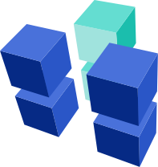
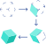

Developers   
==========

## Start building your dApp today

Don’t waste time starting from scratch - Proxeus is an extensive set of tools allowing developers and businesses to create document-centered blockchain applications, certify documents and monetize their IP.

[Try out Proxeus](https://morrison.proxeus.org/)
[Install the app](http://doc.proxeus.com)
[GitHub access](https://github.com/ProxeusApp)

## Introduction

Proxeus combines workflow automation and feature-rich document production with powerful blockchain functionality and wide-ranging integration capabilities. Try building your first application today!

### Open Source

The Proxeus project has been crowdfunded by a community of blockchain enthusiasts, it is open-source and free to use. The XES token is used as a means of payment within the Proxeus ecosystem.  

### Developer Community

The development of Proxeus is being driven by a not-for-profit association based in Switzerland, which is also developing decentralized governance mechanisms for the global community of Proxeus stakeholders.  

### Software Maintenance

The Proxeus Association coordinates the efforts of independent contributors and volunteers who help keep the framework stable and up to date by committing their time and energy.  

### Contributions

Are you interested to support the project? We are always looking to expand the circle of contributors to improve the stability and the capabilities of the software, or to create new plugins. Ideas and designs are just as welcome as code contributions.  

## Run Your Own Instance

You can run and try out Proxeus on your own machine without compiling the code first. In fact you don’t even need any coding skills. Simply pull the [Docker](https://www.docker.com/) image from our [DockerHub](https://hub.docker.com/) repository following the steps below.

### Five Easy Steps

1) Install docker and docker-compose  
2) Get API keys for Ethereum and SparkPost  
3) Create your docker-compose.yml file  
4) Start Proxeus and complete the setup  
5) Log-in and use your own Proxeus platform!

## Integration interfaces

### Capabilities

Proxeus has been equipped with an integration interface that enable users to customize the software and integrate third-party services. With its API and the external nodes interface mechanism it offers simple yet powerful possibilities for future extensions of the platform.  

#### Get Data

You may want your workflows to be able to retrieve data from external sources. You can build custom nodes to fetch data from all kinds of services (e.g. your organisation’s ERP/CRM). The mechanism to feed this information into a workflow instance is really simple! Scroll down for practical examples.  

#### Send Data

Custom nodes can also distribute information at any point in the workflow. Do you want to send an email with a summary before finishing the process? Would you like to give your users an opportunity to share their progress on social media? With Proxeus you can add this to your workflows with just a few lines of code and without having to touch the core software.  

#### Trigger a Workflow

Proxeus lets you authenticate with an API key, list all available workflows and trigger them through the API. You can start a workflow, provide some starting data and let a user manually finish it. If you want, you can even provide all necessary data and complete the workflow without human intervention - using Proxeus as your document production service.  

### Generic and Custom Codes

At its core, Proxeus is a workflow engine that executes the elements of a workflow schema. As a document-centered platform, it comes with forms, conditions and templates. These elements can be configured by normal users without any development knowhow. Developers, however, are given the tools to customize a Proxeus platform in a more profound way.  

#### Generic Workflow Integration

Nodes are steps in a Proxeus workflow. Every user form, condition or document template is a node. When a node is done with its tasks, the workflow continues with the next node. You could compile your own nodes for Proxeus Core or change the existing ones. However, this should only be considered when the custom nodes interface does not satisfy your customization needs.

#### Custom Workflow Nodes

Proxeus comes with a plugin-like mechanism to add custom-made nodes. These extensions can be added without rebuilding the entire application. They can access the workflow instance’s data for reading and/or writing. The nodes are started in separate docker images, register with the external nodes service and are then automatically made available for use in workflows.  

## Application Examples

While Proxeus enables anyone to cover a whole series of use cases out of the box, it becomes even better in the capable hands of a software developer. Feature-rich and optionally monetized dApps can be created in just a few hours. We created two examples to inspire the community - they come with full code and documentation and are deployed on the [demo platform](https://morrison.proxeus.org/).

### Crypto-tax reporting

Compile an overview of your crypto assets. The dApp retrieves the token holdings for an address provided by a user and valuates them using CryptoCompare. The result is used to produce a document, which can be customized to match the requirements provided by a tax authority in a chosen market. The current example charges a usage fee in XES to demonstrate how such applications can be monetized.

### Proof of Existence

Build a proof of (prior) existence application using the blockchain and make it available to third parties for a usage fee in XES. We created an example showing how to enhance a Proxeus workflow with a custom node able to access external data. The workflow available for demo purposes imports and registers Twitter data. The same solution can be used by analogy to create a proof of prior existence for any type of data.

## Endless Possibilities

Using the Core and extensions, Proxeus offers nearly limitless possibilities for creative and resourceful users to create value-adding applications. Here are just a few ideas - get in touch and share yours!

### Generate transactions on various blockchains

Ethereum is home to the XES token and our main blockchain. Do you need to interact with other distributed ledger technologies? We were able to leverage Hyperledger and IOTA in some of our exploratory projects, and the integration interfaces empower you to do the same with any DLT.  

### Deploy a smart contract

Are you an expert at customizing and deploying smart contracts? Why not offer this know-how to others on a Proxeus platform? Design a series of forms to guide users through the configuration steps and deliver a document with the smart contract code and a deployment guide when they reach the end of the workflow.  

### Fetch data from services

No matter how your application landscape changes in the future, your Proxeus platform will be ready to connect to your other services. The integration interfaces give you the freedom to retrieve data from any available source and to make it available to the users of your workflows.  

## A Wide Application Scope

Over the course of years of product development we have completed exploratory projects in several different business verticals: legal, education, logistics, sports and many more. Thanks to the broad feature set and the adaptability of Proxeus, we have been able to use the product in many different ways. Plugging in custom code and using the API enabled us to quickly customize the platform. Read about our exploratory projects and learn how to rebuild them yourself  

## Storage DApp Prototype

This user-friendly, decentralized storage solution empowers anyone to register, share, sign and save documents. It allows users to truly own their data, to associate it with their crypto identity and to control the sharing of it over a blockchain interface. It is a key piece of technology that constitutes a stepping stone for anyone interested to build blockchain products around the concept of self-sovereign identity. The storage provider does not have access to the content, and users know exactly where their files are stored (location and jurisdiction), which is essential for companies subject to data protection laws and creates a base for developing GDPR-compliant blockchain applications.