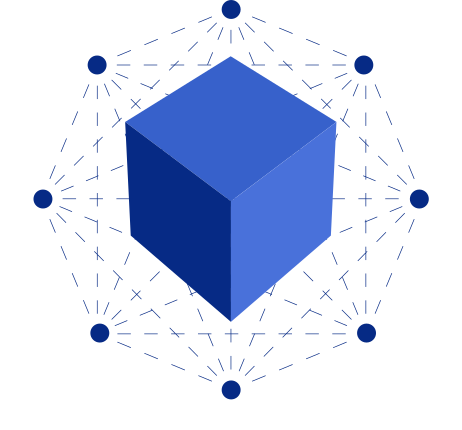
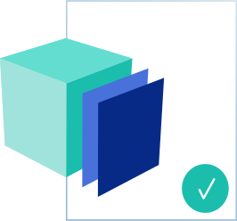
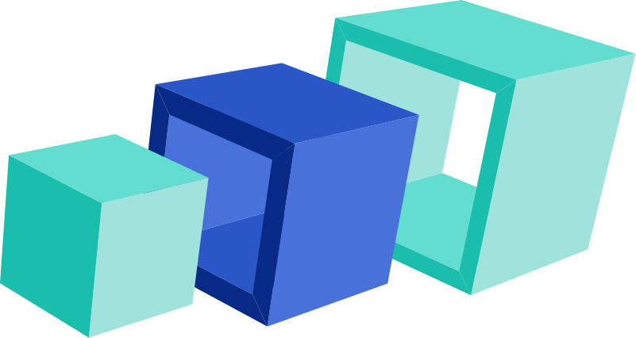

# Discover   

We make blockchain easy
=======================

Discover how the Proxeus framework is being used by the community to digitize legal workflows, certify documents or track goods across a supply chain. Create and test your first document-centered blockchain application in just a few clicks.

How Proxeus Works
=================

Proxeus combines a powerful document automation tool with wide-ranging blockchain functionalities, enabling users to digitize their know-how and to make it available to the community - for free or for a fee.

### Extensions

Extensions are stand-alone applications created by the community. Developers are empowered to enhance Proxeus with new functionalities and to connect Proxeus with various blockchains and with external systems such as ERPs.  

### Integration interfaces

The integration interfaces allow extensions to connect to the platform in order to exchange information or to automate operations. Proxeus is designed as an ecosystem enabling community members to contribute additional functionalities.  

### Proxeus Core

The Core is the open-source “engine” that provides the essential functionality of any system built on top of the Proxeus technology stack. It is maintained by the community and receives contributions from the various developers.  

### Blockchain

Proxeus “out of the box” uses Ethereum as the default setup to connect identities, register hashes and issue payments using the Proxeus Token (XES). Interactions with various other blockchains can be set up via the integration interfaces to fit the requirements of specific use cases.  

Key Features
============

### Workflows

Design document-centered workflow processes by connecting objects on a simple drag & drop interface. Create your own custom nodes to perform all kinds of actions and connect with third-party systems.

### Forms

Forms guide data acquisition through workflows. A large set of components - including items such as text fields, radio buttons, checkboxes and dropdowns - facilitates the data collection and validation.

### Templates

Design templates in your preferred office suite and apply the data collected by forms to produce one or several documents. You can go all the way from simple placeholders up to complex business logic using Jtwig.

### Marketplace

Workflows represent a powerful way of encapsulating know-how. Publish your work and make it available to others for free or for a fee. All transactions are made in XES on a peer-to-peer basis.

### Notarization

Make your documents tamper-proof and easily verifiable by registering the file hash in a smart contract together with the Ethereum ID of your Proxeus account as the issuer. Drag and drop to verify.

### Signatures

Request signatures and approve or reject documents shared with you. The cryptographic signature module can be implemented to enable further use cases such as conditional agreements and voting.

Extensions
==========

### Get Data

Extensions can be used to call an external service as part of a workflow execution in order to load data into a Proxeus workflow instance (e.g. retrieve information from an external service or from your ERP).  

### Send Data

Extensions can be used to distribute information to external systems from any point of a running workflow instance (e.g. send a confirmation email, post to social media or create a CRM entry).  

### Trigger a Workflow

Extensions can be set up to observe a specific blockchain or smart contract and trigger a Proxeus workflow automatically following the occurrence of pre-defined events (e.g. signature of a transaction by a certain identity).  

Application Examples
====================

Proxeus plays the role of a bridge connecting two worlds, allowing you to digitize traditional processes and register information on a blockchain, as well as to make blockchain activity visible by generating human-readable documents.

### Crypto-tax reporting

Compile an overview of your crypto assets. The dApp retrieves the token holdings for an address provided by a user and valuates them using CryptoCompare. The result is used to produce a document, which can be customized to match the requirements provided by a tax authority in a chosen market. The current example charges a usage fee in XES to demonstrate how such applications can be monetized.

### Proof of Existence

Build a proof of (prior) existence application using the blockchain and make it available to third parties for a usage fee in XES. We created an example showing how to enhance a Proxeus workflow with a custom node able to access external data. The workflow available for demo purposes imports and registers Twitter data. The same solution can be used by analogy to create a proof of prior existence for any type of data.  

Exploratory Projects
====================

Proxeus is industry-agnostic. Over the past two years, the Proxeus framework was made available to a series of partners interested to take on a pioneering role, allowing to challenge and concretize the product requirements along the way. In several instances, the outcome of these collaborations was made public in the form of inspiring use cases, some of them generating attention from global media.

### Legal

The process of legally registering a new company in Switzerland relies heavily on printed documents and currently takes up to six weeks. This process was streamlined using Proxeus and a Hyperledger smart contract, resulting in the incorporation of a new company in less than two hours.

### Education

As certain companies are setting up procedures to verify academic credentials presented by candidates, we showed how Proxeus can be used to register university diplomas on the Ethereum blockchain and issue trusted digital documents that can be verified by employers independently.

### Sports 

Professional sport is highly prone to fraud, which has led to the occurrence of several public scandals over the last years. The project consisted of prototyping new ways to deliver an existing process for an anti-doping organization, resulting in increased efficiency and auditability.

### Tokenization

We explored the possible role of the workflow and document automation capabilities of Proxeus in the asset tokenization space and designed a tool allowing to input technical attributes and price-defining data into a documentation that can be registered and certified by external experts.

### Logistics

We looked into possibilities to track shipments through the use of physical devices by combining Proxeus with IoT devices and IOTA, making possible to instantaneously generate digital documents providing reliable and immutable tracking information for the transit of goods from A to B.

### Data Storage

We explored ways to associate user data with their crypto-identity and to control the sharing of it over a blockchain interface, resulting in a prototype that constitutes a stepping stone for anyone interested to build blockchain products around the concept of self-sovereign identity.

