# Key Features

Proxeus Workflows
=================

In past articles we explored Proxeus forms, smart templates and the document service. Proxeus workflows is where all elements come together — let’s take a look how they constitute the backbone of every Proxeus application by defining the process logic and connecting to various actions and input sources.

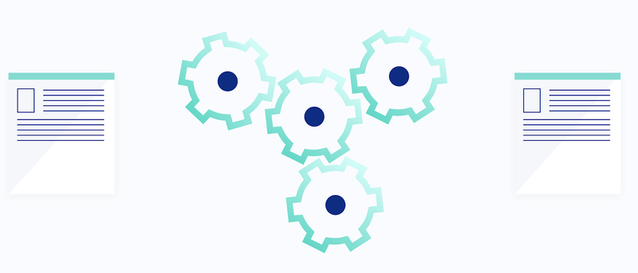

### What is a Proxeus workflow?

A Proxeus workflow is a series of sequential steps that are carried out based on user-defined rules or conditions in order to execute a business process. Workflows enable Proxeus users to [digitize their know-how](https://medium.com/proxeus/proxeus-wrap-your-know-how-digitally-a99150875ffe) and to make it available to third parties, for free or for a fee paid in XES.

### Creating and editing workflow

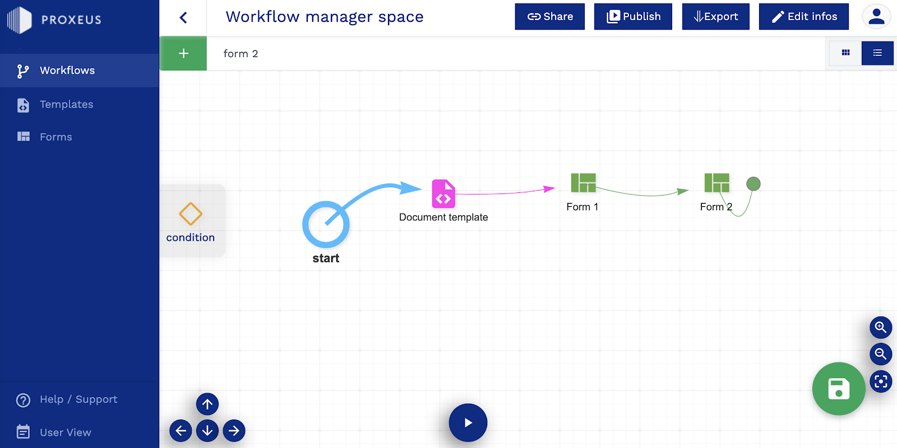

The workflow manager offers an interface to assemble and update workflows by combining [forms](https://medium.com/proxeus/gather-structured-information-using-proxeus-forms-e08abcf103aa) and [smart templates](https://medium.com/proxeus/using-proxeus-smart-templates-957eefb75315). Components are added to the workspace via drag & drop and can then be dynamically linked in a sequential flow. Data sources or external services are integrated through the addition of connectors. The resulting workflow can be given various access rights and made available to third parties in the front-end.

### Workflow logic

“Conditions” may be added as graphical elements in the workflow to enable the creation of dynamic decision engines that make the logic, steering and scope of the data collection process dependent on values entered by the end users during the workflow execution process. They can be created easily using IF-functions of JavaScript. Examples are available in the Proxeus [handbook](https://docs.google.com/document/d/1C3B1oNY6lOv8Q_AvbKhwlySrS6qTiRl3raPLV6OXr7w/preview#heading=h.t8n5j48zabtn).

‍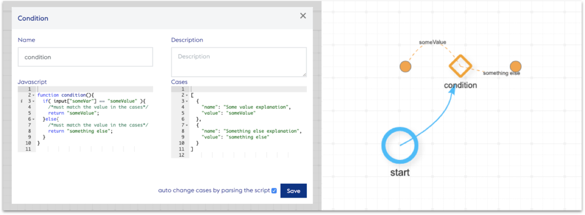

_Example of a simple condition element: script (left) and workflow view (right)_

### Process finalization

Following the completion of all steps, workflows are finalized by calling the [document service](https://medium.com/proxeus/proxeus-document-service-document-templating-made-easy-5304b4ead44e). It then generates the final document(s) by combining the data collected via forms and connectors during the workflow execution together with the variables from document templates that have been included into the workflow. As a final step of every workflow execution, the human readable workflow output (.pdf) is hashed and the hash registered on the Registry Smart Contract (which has been set up by the operator as part of the initial platform deployment, alongside a record of the Ethereum identity of the end user as the issuer of the document). The validation of the corresponding transaction also gives the possibility to add a public reference in order to make the documents registered more easily identifiable.

### Custom connectors and nodes

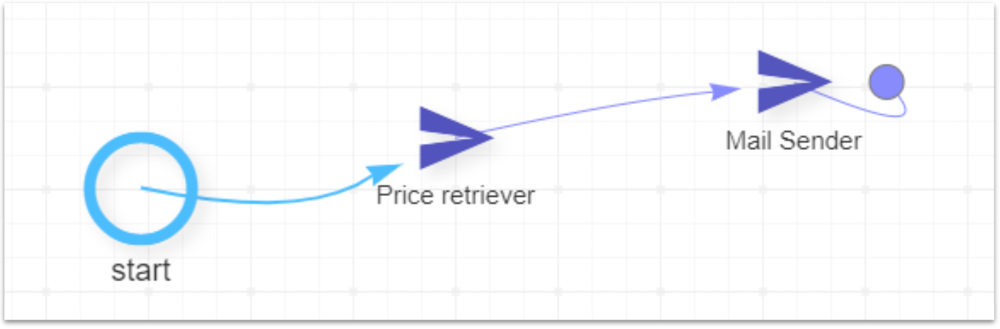

_Representation of custom connectors in the workflow workspace_

“Custom Connectors” are workflow nodes that extend the possibilities offered out of the box by connecting to external services in order to retrieve data from a designated source or to execute predefined operations (such as sending an email notification). Custom connectors and nodes will be the subject of a separate post detailing the different possibilities they offer to augment the Proxeus experience.

### Machine-readable output

The machine-readable workflow output — a JSON containing the values collected for the variables specified in the workflow — is stored on the platform database and can be accessed via the I/O layer. In addition to manual inputs from end users during the workflow execution, forms can be populated via API calls to external services using the I/O layer. Combined with the possibility to trigger workflows based on the occurrence of certain events, this functionality enables workflow creators to build a fully automated document production service for their use case.

### Interoperability

The workflows can be exported locally and are operable on any Proxeus platform, ensuring that workflow creators and their intellectual property (expressed as workflows, forms and templates) are not dependent on a specific Proxeus platform.

Are you working on interesting use cases pushing the limits of what the framework offers? Are you wondering whether Proxeus can be used to implement your idea? Share your progress with us and get in touch with our dev team, we are always grateful for feedback and happy to support!

‍Proxeus Smart Templates
=======================

November 21, 2019

In the digitization of a process, the creation of a human-readable output in the form of a document is often an important aspect. Proxeus enables users to create and use smart document templates comprising not only the desired layout and static content, but also a logic implemented through dynamic variables that can be filled into the forms that are part of the workflow. The functionality can be compared to “serial letters” in Microsoft Word, but is designed in a much more powerful way.

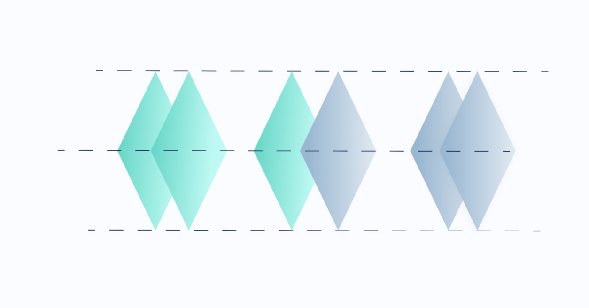

### What are Proxeus smart templates?

Proxeus smart templates are document templates created by users and added to a workflow. Upon workflow completion, they are sent to the [Proxeus document service](https://medium.com/proxeus/proxeus-document-service-document-templating-made-easy-5304b4ead44e) alongside data collected via forms or API in order to produce a human-readable output.

### What makes those templates special?

Users are entirely free to define their own content and layout to produce any document they need. While the basic templating features enable non-technical users to create simple templates within minutes, advanced users can use the full spectrum of the [JTwig templating engine](http://jtwig.org/documentation/reference) to create smart templates. Those can include formulas and even scripts, allowing users to implement a complex logic into their documents.

### What is the document format used for templating?

Templates are created using the OpenDocument Text Document file format (.odt). Such files can be generated by open-source office suites such as LibreOffice and Apache OpenOffice, but they are also supported by Microsoft Word and Apple TextEdit, which makes them very versatile.

### How can I create a template?

In order to create a template, start by drafting a workflow that collects inputs (for example a name) via Forms or Connectors. Let’s say that you would like to collect an email address: start by naming the input variable on the form (for example “input.EmailAddress”), then take your document template and simply add the variable {{input.EmailAddress}} at the place in the document where the user-entered input should appear. Lastly, upload the template and add it as an object to the workflow. A document using this template will then be automatically generated each time your workflow is run. If you would like to see a template in action, we added a simple example that you can re-use on the Proxeus [demo platform](https://morrison.proxeus.org/).

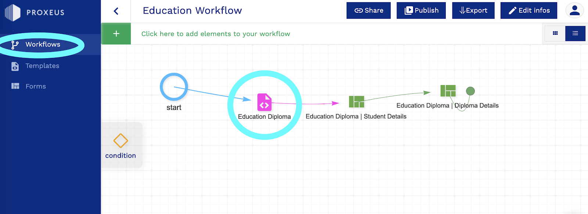

### Too complicated?

In order to facilitate the creation of templates, variables entered into the form elements selected for the current workflow are automatically made available to the user in the right format via the “Templates” workspace. Click the variable to copy it to the clipboard and paste it into your document. The document preview functionality enables you to quickly test and fix your templates. Go to the “Templates” workspace to preview the result of your actions in real time.

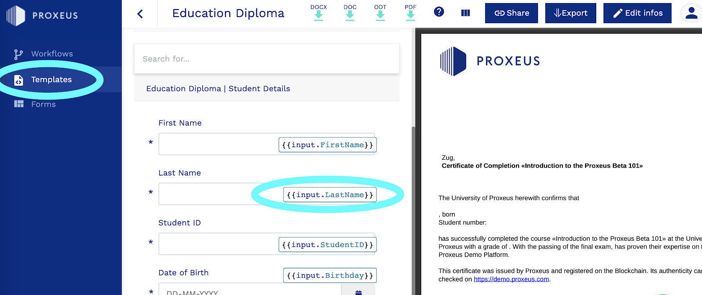

### Where can I find more information?

For a complete guide on templating, please check our [templating handbook](https://docs.google.com/document/d/1-vJsTrU3w8dEcDr3-nV5owtxqHWSjzEf2uk6m9-cMIs/preview). Share your best results and contact us if you get stuck or if you are struggling to implement a complex functionality — we’ll be happy to help!

‍

Proxeus Forms
=============

December 17, 2019

This week we take a closer look at Proxeus forms which collect data from human users or from Blockchain events and make this information available to create any type of document.

### What are Proxeus forms?

Proxeus forms enable workflows to collect information from users (humans and machines). Each form allows to structure one segment of the data acquisition. Let’s say for example that you would like to create a [company incorporation workflow](https://medium.com/proxeus/proxeus-helps-speeding-up-swiss-business-incorporations-dd0eed421576): the first step will be to ask users for a series of details (domicile, company name, number of shares, members of the board, etc.). This information will then be exported in a machine-readable format and applied to a series of [smart templates](https://medium.com/proxeus/using-proxeus-smart-templates-957eefb75315) in order to produce a human-readable output that can eventually be reviewed and [signed](https://medium.com/proxeus/building-dapps-signature-integration-f2c7f5912595) by the various parties at stake.

### How are forms created?

The Forms workspace is accessible via the backend view of the Proxeus platform. There, the form generator offers an interface to create, duplicate and update forms, as well as to manage the access rights for the forms you own. A large set of components is available by default, including items such as text fields, radio buttons, check boxes and drop-downs.

Those standard components can be dragged from right to left and arranged freely on the form. A click on a component opens a section on the right where attributes can be selected. On top of the mandatory specifications, users can add a number of optional elements, such as help texts or conditions for validating the data that is inputted.

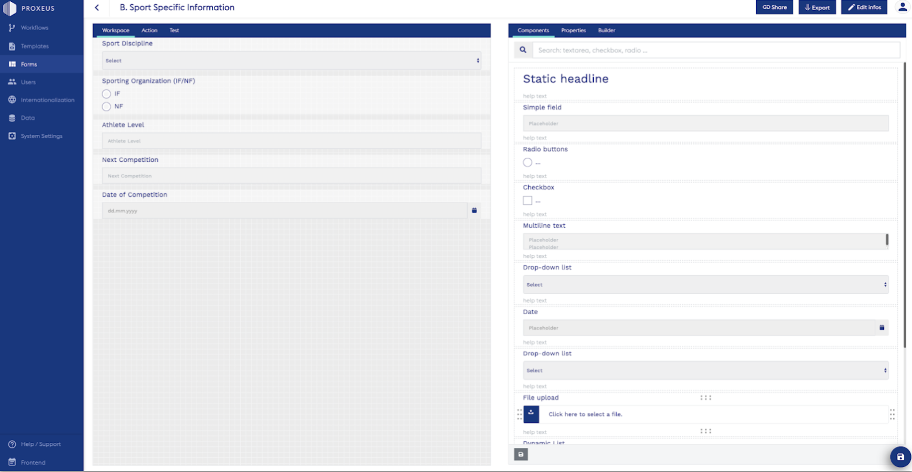

### Custom components

While the broad range of standard components can be used by anyone without specific programming skills, Creators with knowledge of JavaScript, HTML, and JSON have the flexibility to customize existing components or create new ones from scratch. This feature enables advanced users to create custom fields tailored to their needs, such as adding a special phone number field that validates inputs against the Canadian phone number format, or checking if the input is a valid Ethereum address or an existing Twitter handle.

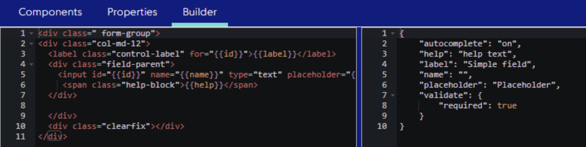

Once created, forms can be accessed and assembled from the workflow manager. They can be shared with multiple workflows and therefore be used in different contexts. This means that the time you spend setting up advanced data collection tools (for example creating a custom drop-down list to reflect your company inventory) is an investment that you can benefit from in different contexts because the components will be updated across all of your workflows every time they are modified.

### Conditional formatting

An important feature allowing you to streamline the data acquisition flow is the possibility to add elements that will be displayed to the user only if certain conditions are met. If you create a [collectible car certificate](https://medium.com/proxeus/blockchain-enables-investing-in-classic-cars-for-everybody-not-just-millionaires-5e9dec740aee), you will for example want to ask for different information depending on the brand or model selected in the first place. This can be done easily via the “Action” tab, where those dependencies can be programmed visually.

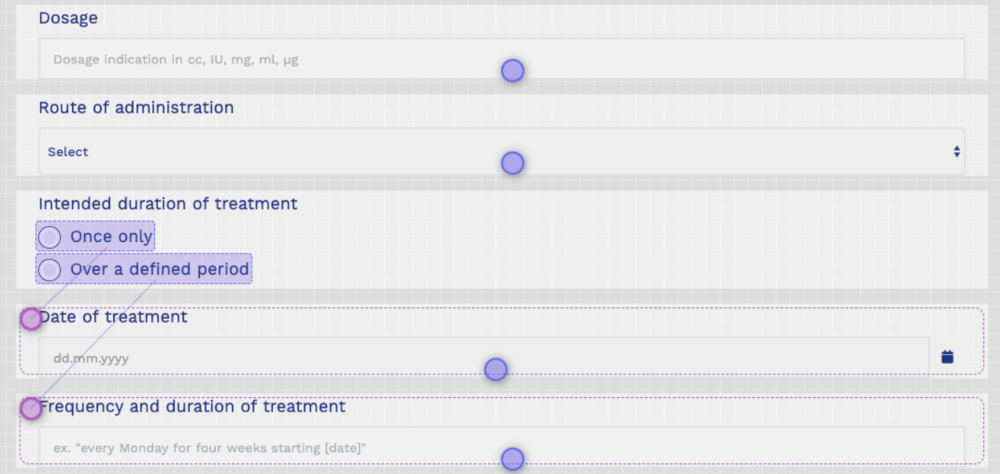

### One last check

Select the “Test” tab and you will see the form as it will be presented to the endusers on the platform. This comes quite handy to briefly test your logic without requiring to actually publish and test the workflow.

What interesting application did you implement using Proxeus forms? Share your experience and let us know how we can support you!

‍Building DApps: signature integration
=====================================

October 29, 2019

Proxeus comes with a fully-fledged signature feature, allowing to send and receive signature requests. Signing a document creates a public cryptographic proof that can be checked on the blockchain by anyone in possession of the document.

### How do signatures work?

The signature feature on Proxeus allows to request and record cryptographic signatures of a document hash using the Ethereum identity associated with a Proxeus platform user account. These signatures are recorded in the platform’s Registry Smart Contract.

Once the workflow execution is completed and the hash has been added to the Blockchain Registry, the finalized document can be accessed from the “Documents” tab in the frontend view of the Proxeus platform.

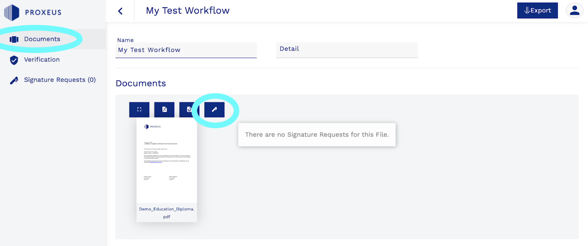

Users have the possibility to go beyond this default document / issuer registration and to request additional signatures from other Proxeus platform users in order to record the agreement of multiple parties on a document. The “Documents” view shows the status of all signature requests issued so far. As long as a signature request is pending, it can be cancelled by the requestor.

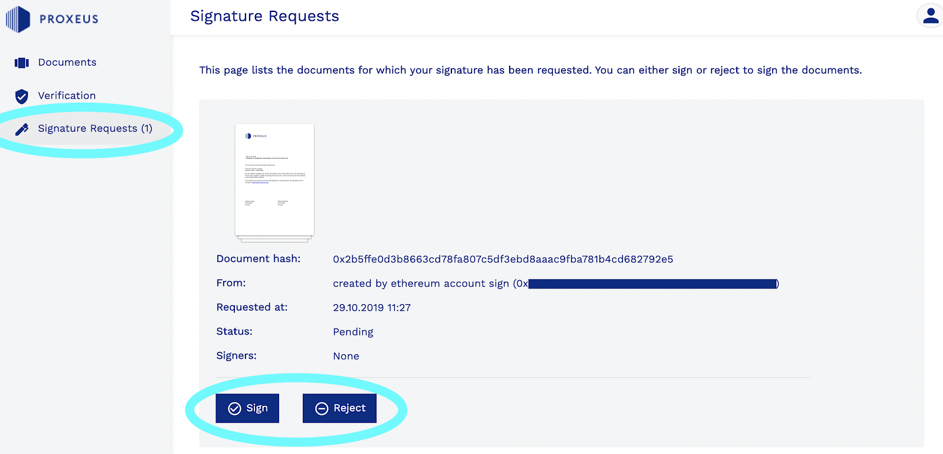

Users are notified of signature requests via a notification email. Requests can be accessed from the “Signature Requests” tab in the frontend view, where users can decide whether to sign the document or to reject the request. In order to give their signature, users are prompted to sign a transaction with Metamask, which will add the Ethereum identity associated with their Proxeus platform account to the Registry Smart Contract entry for the document as signatory.

### What can I do with signatures?

Signatures are an important blockchain feature and can be used to signify approval in many different ways. Depending on your use case, they can be implemented to provide a simple confirmation (such as in a review process in a company), or to give formal approval to entering a business relationship with partners or customers. But the same feature can also be used to fulfill many different use cases. Imagine for example that you are interested to build a voting mechanism: just issue a series of requests to people whom you want to give a voice to and set up a blockchain observer module to watch over the answers provided (requests confirmed or declined) — the result can be used to automatically generate a document via the Proxeus API that features the vote result and is sent to the relevant participants.

### Linking signatures with identities

An important question users will face is: how can I know who is behind a wallet? Who is signing? If you are building prototypes, simple solutions such as publishing the wallet address on each party’s website, or having the identity confirmed on a case by case basis by a notary can do the trick. If you are looking to set up a productive system, you could look into integrating Ethereum Name Service or identity solutions such as uPort and more generally self-sovereign identity solutions building on the W3C DID standard.

Let us know if you are working on a use case involving signatures, especially if you are looking at creative ways to use them — we are curious to learn more and happy to assist!

‍