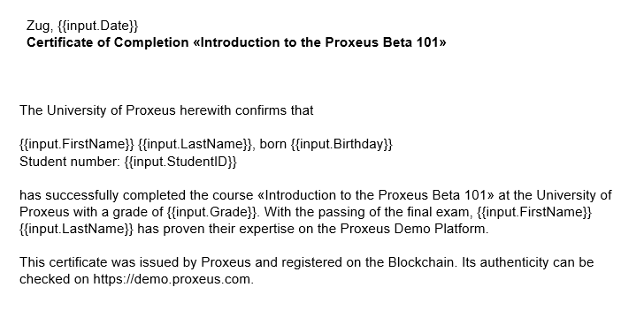
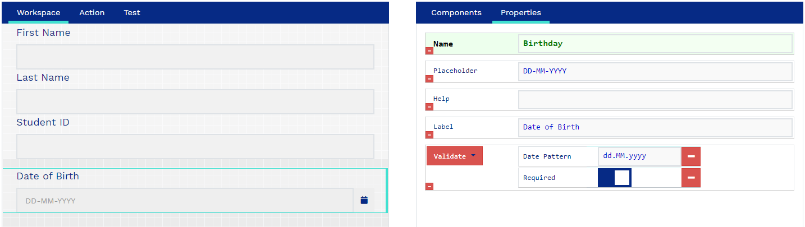
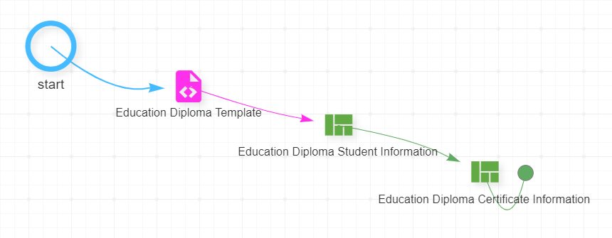
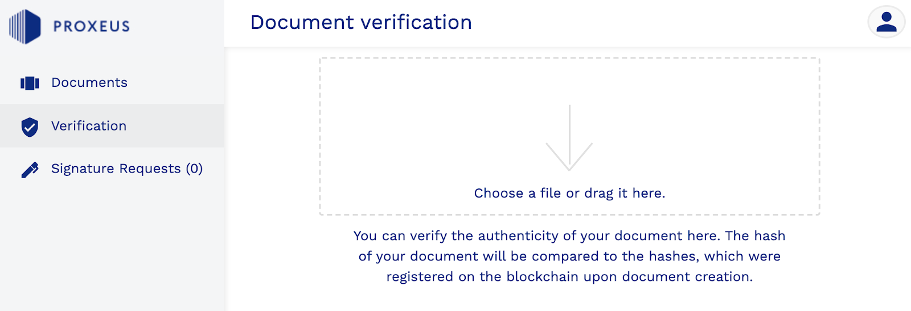

# Application Examples

Proxeus plays the role of a bridge connecting two worlds, allowing you to digitize traditional processes and register information on a blockchain, as well as to make blockchain activity visible by generating human-readable documents.

Crypto Asset Reporting
======================


### Abstract

This practical example shows how you can use Proxeus and its extension capabilities to build a dApp that generates a crypto asset report for any Ethereum wallet. It showcases Proxeus’ ability to access data sources within the Ethereum ecosystem as well as its effectiveness in generating standardized documents.


By creating a simple custom workflow node, enhanced a Proxeus workflow with the capability to access external data. This data is then used in a workflow that can be published and offered to other users for a fee using the XES token.


### The idea
Whereas a bank can provide you with a list of your accounts and assets, most cryptocurrency exchanges and wallets do not offer a comparable service yet. Systematically keeping track is a hassle. When it comes to the yearly tax declaration, token holders have to unlock their wallets, export or even write down all holdings and calculate the end-of-year value of each position. This requires knowhow and manual labor due to the absence of standardized processes and tools. Since the assets are managed on a public ledger and can be accessed fairly easily, it should be possible to automate some steps.


### The solution

All Ethereum-based tokens present on your Ethereum wallets can be queried using existing tools such as Etherscan. Combining this data with the end-of-year valuation of each token produces the list most tax authorities ask for: the name of the asset, the amount held at the end of the year and the value of the position held. It could even be inserted directly into the respective forms of the tax software if an interface is provided.

#### A crypto asset reporting workflow in Proxeus

The workflow should have elements that can do the following things:
‍
1) Ask the user to specify the wallet for which the report shall be created.
2) Retrieve the crypto assets of the selected wallet.
3) Look up the valuation of each asset.
4) Create a PDF report with this information, optionally using a template provided by the user’s tax authority

For steps 1) and 4) we can simply use out-of-the-box functionality of Proxeus. For points 2) and 3) we can implement custom nodes using Proxeus’ external nodes interface. We’ll explain the details a bit further down in this article.


#### About the external nodes interface

The external node interface allows anybody to develop custom-made workflow nodes that can be added without having to modify the Proxeus software. These custom nodes register themselves with the external nodes interface and are then automatically made available for use in workflows by Proxeus Core. Community members can exchange custom nodes simply by making their code or Docker images available. As the nodes can read and write workflow data and are unrestricted in their communication with external systems, they unlock enormous potential and an easy path for extending the core.

The Proxeus Golang library for external nodes is documented in its [Github Repostory](https://github.com/ProxeusApp/node-go.git)

## Check out our demo Workflow

The complete crypto asset report workflow is available on our demo [platform](https://morrison.proxeus.org/). It will be copied to your account automatically when you sign up.

You can start by just running the workflow: User View > Documents > “New document”.

In the admin panel you can analyze how we configured the workflow and as you have your own copy, you are free to make any changes to it.

## How to rebuilt it yourself

If this is your first contact with Proxeus, we recommend you familiarize yourself with the platform first before trying to tackle this example. The “Demo” section on the website provides you with a quick overview.

#### 1) Create a user form

It should inform the user what needs to be done (enter a wallet address) and collect the required input; in this case the wallet address. In our example we used a title element and a simple text input. In the design view on the left it looks like this:


A good form validates user input to prevent user mistakes. With regular expression we can check if the input is a valid Ethereum public address: ^0x[a-fA-F0-9]{40}$

The components configuration on the right side of the form builder will then look as follows:


The name of the input component, ethAddress, is important. It is the variable name to access that input later in the workflow.

#### 2) Retrieve balances

Now we can retrieve the ETH and ERC-20 balances of the input Ethereum address using a custom workflow node. Our example implementation can be found on GitHub: [node-balance-retriever](https://github.com/ProxeusApp/node-balance-retriever.git).

If you wish to build it yourself, we recommend studying the documentation of the [external nodes interface](https://github.com/ProxeusApp/node-go.git). For Golang there is an official implementation of Ethereum: [go-ethereum](https://github.com/ethereum/go-ethereum.git). You could run your own Ethereum node for quick access to the data - or use a service like Infura.

#### 3) Determine asset valuation

After finding out what crypto assets the user holds, the next step is to determine the value of each position. Price aggregators such as CoinMarketCap, Livecoinwatch or CryptoCompare are usually a reliable source of information as they do not rely on a single exchange only. For your example we’ve used the [API of CryptoCompare](https://min-api.cryptocompare.com/).

Our example implementation can be found on GitHub: [node-crypto-forex-rates](https://github.com/ProxeusApp/node-crypto-forex-rates.git)


#### 4) Design a report template

Now you can start designing the template for your report. Create a layout to your liking and add the placeholders to be replaced by the Proxeus document service. The amount of Ether in the wallet, for example, will be available through the variable name “ETH” while its price is “USD_ETH”. You would add it to the template as

```{{input.ETH}} and {{input.USD_ETH}}```

In our example you’ll also have XES, MKR, BAT, USDC, REP and OMG at your disposal.

To display the total value of a position, you’ll have to multiply the two values amount and price:


```{{input.ETH * input.USD_ETH}}.```

The sum of all tokens could be displayed as follows:
The ERC tokens amount to a total of USD 

```{{((input.XES * input.USD_XES)+(input.MKR * input.USD_MKR)+(input.BAT * input.USD_BAT)+(input.USDC * input.USD_USDC)+(input.REP * input.USD_REP)+(input.OMG * input.USD_OMG))}}.```

You can download our example template here.

#### 5) Complete the workflow design

Now all the elements of the workflow are ready and just have to be added to a workflow and put in the right order. The template comes first, followed by the form, which asks the user for the wallet address. Then the first custom node retrieves the balances, for which the second module then fetches the valuation. Lastly the data is inserted into the template and rendered as a PDF.


External nodes can have a configuration UI that can be reached via the workflow editor and a double-click on the node’s symbol. The “Crypto to Fiat Forex Rates” node, one of our examples, has the following UI:


The UI is defined in the node’s code as HTML:


```
const configHTML = `
<!DOCTYPE html>
<html>
<body>
<form action="/node/{{.Id}}/config?auth={{.AuthToken}}" method="post">
Convert to Fiat currency: <input type="text" size="2" name="FiatCurrency" value="{{.FiatCurrency}}">
<input type="submit" value="Submit">
</form>
</body>
</html>
`
```

#### 6) Publish and monetize your workflow (optional)

If you have the knowledge how to compile a good report on crypto assets, this may be valuable to other members of the crypto community. Why not offer it to them for a fee in XES? In the workflow editor, you can set the price. Save, hit “Publish” and start advertising! All fees will automatically be paid to the wallet that you have connected in your user profile on the platform.


## Limitations

1) To ensure that this example can be reproduced with reasonable effort, we have opted for two simplifications.
We retrieve the assets held at the time of execution. This means that the report has to be created at the end of the year or before making trades in the new year. Retrieving the amount held at Dec 31 at midnight would require detailed historical data - not just the block headers - which is possible only through a full archive node of Ethereum. Most users do not have access to such a node as it is usually a premium service by providers like Infura.

    If you have access to a full archive node, you can retrieve the balance as follows using the [Ethereum JavaScript API:](https://github.com/web3/web3.js.git)

```eth.getBalance("<ADDRESS_HERE>", <BLOCK_NUMBER>);```
‍
‍
For ERC-20, you need the token’s contract address (as retrieved in our example) and the contract’s ABI. The ABI is instantiated as follows:

```
var tokenContract = eth.contract([{
"type":"function",
"name":"balanceOf",
"constant":true,
"payable":false,
"Inputs":[{"name":"","type":"address"}],
"outputs":[{"name":"","type":"uint256","value":"0"}] 
}]);‍ 
```


‍
The balance can then be retrieved like this:

```
> var erc20ContractAddress = "<ADDRESS_OF_TOKEN'S_CONTRACT>";
> var account = "YOUR_ADDRESS";
> tokenContract.at(erc20ContractAddress).balanceOf(account);
```

2) We fetch the price of each asset at the time of execution. Ideally the report would perform a lookup on the official list provided by the tax authority. This differs from country to country and can usually be looked up on the website of the tax authority.
We hope you’ve enjoyed this example. If you have any questions, the Proxeus community is always happy to help. When looking for help, please make sure to provide a good description of your problem and what you’re trying to achieve.


Practical Example: Proof of Existence
=====================================


## Abstract

In this practical example we’ll show you how you can use Proxeus to build a dApp for the proof of (prior) existence use case on the blockchain. It showcases Proxeus’ capabilities to interact with external systems as well as with its native blockchain Ethereum.

Using a simple custom node, we enhanced a Proxeus workflow with the capability to access external data. This data is then used in a workflow that you can offer to others for a fee using the XES token.

## The problem

More and more people earn revenue from creating content on online publishing platforms such as Medium and social media platforms such as Twitter, Instagram or LinkedIn. These creators depend on views and engagement for their income, but have few possibilities to defend their intellectual property. If they need to enforce their rights, they carry the burden of proof that their content existed prior to the other publications - and they cannot rely on the platforms for help.

## The solution

Register new content with a trusted and independent source of truth upon publication, including a timestamp providing evidence that the creator was in prior possession of the content before other parties published it. The Ethereum blockchain provides an ideal support for that.

To create this evidence, we need to bring original content into a format that can be registered on the blockchain and made verifiable. The users should be able to easily produce the proof of existence with a simple snapshot every time a new post is made.

For demo purposes, we created a workflow that imports and registers Twitter data. The same solution can be used by analogy to create a proof of prior existence for any type of IP using Proxeus.

#### 1)Building a proof of existence workflow in Proxeus

The workflow should have the following components:

1) Entering the unique identifier (id) of the Tweet you want to register.
   
2) Retrieving the Tweet and its metadata from Twitter.
   
3) Creating a PDF with this information.
   
4) Registering the PDF on the blockchain.
   
Points 1), 3) and 4) can be solved with standard Proxeus functionality. For point 2) we need to build a custom node that takes the content identifier from the workflow data, uses the Twitter API to retrieve the Tweet and then feeds it back into the workflow. As a developer you could have a look at our example custom nodes and figure the rest out yourself - or bear with us as we talk you through the steps with full code examples.

#### 2)About the external nodes interface

The external node interface allows anybody to provide custom-made workflow nodes that can be added without having to modify the Proxeus software. These custom nodes register themselves with the external nodes interface and are then automatically made available for use in workflows by Proxeus Core. Community members can exchange custom nodes simply by making their code or Docker images available. As the nodes can read and write workflow data and are unrestricted in their communication with external systems, they unlock enormous potential and an easy path for extending the core.


## Check out our demo workflow

The complete proof of existence workflow is available on our [demo platform](https://morrison.proxeus.org/). It will be copied to your account automatically when you sign up. 

You can start by just running the workflow (User View > Documents > “New document”). 

In the admin panel you can analyze how we configured the workflow and as you have your own copy, you are free to make any changes to it.

## How to rebuild it yourself

If this is your first contact with Proxeus, we recommend you familiarize yourself with the platform first before trying to tackle this example. The “Demo” section on the website provides you with a quick overview.

### 1) Create a user form
It should inform the user what needs to be done and collect the required input; in this case the unique identifier (id) of the Tweet you want to register. In our example we used a title element and a simple text input. In the design view on the left it looks like this:

A good form validates user input to prevent user mistakes. That is why we added a number validation to the form component.

The components configuration on the right side of the form builder will then look as follows:


The name of the input component, TweetID, is important. It is the variable name to access that input later in the workflow.

### 2) Retrieving a Tweet and its metadata

Now we can retrieve the Tweet and its metadata from Twitter, using a custom workflow node.

If you wish to build it yourself, we recommend studying the documentation of the [external nodes interface](https://github.com/ProxeusApp/node-go.git).

### 3) Design a report template

Now you can start designing the template for your proof of existence. Create a layout to your liking and add the placeholders to be replaced by the Proxeus document service. The Tweet URL, for example, will be available through the variable name “URL” and the Tweet content through “CONTENT”. You would add it to the template as {{input.URL}} and {{input.CONTENT}}. In our example you’ll also have TIMESTAMP, and TWEETID at your disposal.

You can download our example template [here](https://drive.google.com/file/d/1VqaAcYAoZ6L9bgGvWpsk_AT1IapdvmDz/view).

### 4) Complete the workflow design
Now all the elements of the workflow are ready and just have to be added to a workflow and put in the right order. The form comes first and asks the user for the Tweet ID, then the custom node retrieves the Tweet and its metadata. The data is then inserted into the template and rendered as a PDF.


### 5) Publish and monetize your workflow (optional)

Proxeus can serve as a marketplace for workflows. The price setting and the payment procedure are already built in. Now that you’ve created a “proof of existence” workflow for Twitter, why not offer it as a service to popular Twitter accounts? You can charge a fee for every workflow execution, for every secured Tweet!

But why stop here? The same principle can be applied to all other content creation platforms. Create workflows to secure Medium articles or LinkedIn posts! Now that you know how to create a proof of existence workflow, you can use this blockchain-powered use case for any similar business idea.

## Ideas for further development
This example has been kept fairly simple in order to demonstrate the principles and make sure it can be reproduced easily and quickly. Here are some ideas if you would like to go further.

- Using an Ethereum identity provider, you could strengthen your proof by establishing a trusted link between the user’s Ethereum address and real life identity.

- You could change the workflow so that the content is secured BEFORE it is published on the chosen social media platform platform.

- You could fetch and secure the last 5 Tweets instead of just one specific Tweet.

- Instead of asking for the Tweet ID for input, you could ask the users for their login credentials and then automatically retrieve the latest Tweet.

‍__*We hope you’ve enjoyed this example. If you have any questions, the Proxeus community is always happy to help.*__


Legal : Incorporation of Swiss companies
========================================


## Background

The process of legally registering a new company in Switzerland heavily relies on printed documents that have to be exchanged between several parties, and can take up to six weeks. Correctly filling out documents and sending right ones to the right parties in the right order alone can cost weeks to people unfamiliar with the process.

The gathering and exchange of information between the participants is very time consuming and error-prone. The main document can be 30 pages long and every detail needs to be thoroughly verified by a notary before the documentation is handed over to the official business registry. As there are

## Use case exploration

As part of a challenge by [digitalswitzerland](https://digitalswitzerland.com/), Proxeus joined a project initiated in 2017 by IBM, E&Y and Swisscom, aiming to change the status quo and accelerate the registration of Swiss companies. The project team consisted of lawyers, notaries, banks, authorities (register of commerce), IT service providers and software developers.

Following several workshops where the various processes were analyzed, discussed and streamlined. A prototype was built and several improvement loops were done until the point when the group felt confident enough to present the solution publicly. In May 2018, a public demonstration showed that the total time to incorporate a company can be reduced to less than two hours by using the Proxeus document workflow automation engine and a blockchain to coordinate processes more effectively.

## Implementation

The solution consists of a Proxeus platform with workflows for the different legal forms that can be registered, starting with simple forms and adding others later. The workflows comprises a series of smart forms that validate all inputs immediately. This highly simplifies the processes for data entry, document creation and data exchange between all the parties that are involved. Information that had to be entered redundantly up to 30 times is now only entered once in a Proxeus form. Input validation that had to be done manually before, happens automatically now. Tasks that previously had to be tackled sequentially, due to the need to move paper dossiers around, can now be completed in parallel.


### Excerpt from one of the user forms of the incorporation process

The workflow also includes a conditional alternative path, depending on if the founder has already opened a capital deposit account at a bank. If he has not, two additional forms are shown and one more document is produced.

### Conditional alternative path

At the end of the workflow, all needed documents are created and their hash is registered on the Ethereum blockchain, making the document tamper-proof and verifiable. While Proxeus provides a verification tool for its users’ convenience, the entries are made on the public Ethereum blockchain and may also be checked using block explorers like Etherscan or custom tools.

### One of the workflow versions used to incorporate a company

At the end of the workflow, a custom node built for Proxeus’ integration layer interacts with a service developed by the project partner IBM. Through this service, Proxeus is connected to a votation contract on Hyperledger Fabric, allowing the relevant stakeholders (entrepreneur, lawyer, bank, notary, public register) to verify and sign the documents produced. The bank states that the capital money has indeed been paid; the notary confirms that the necessary documents have been provided, read over, and approved; and the commercial register performs a final check that everything is accurate and lawful. After successful collection of all confirmations, the filing is officially registered with the Commercial Register and Official Gazette of Commerce.

## Result

The Proxeus platform set up specially for the business registry project was well-received by all parties. Using the workflows proved intuitive for users of all kinds of professional backgrounds. When the first real business incorporation was done using the platform, it took less than two hours, crushing the initial objective of 48 hours.

<strong> This achievement was a Swiss – and likely world’s – first! </strong>

The prototype worked so well that the test phase has then been prolonged to register up to 100 companies with Proxeus. By now, dozens of companies have been registered through Proxeus workflows and the process has been fine-tuned several times by the project team. In 2020 the platform is still live and being used and maintained by the project participants. The next step for the project, which has already began, is the onboarding of further notaries and lawyers, who will at their turn incorporate companies through Proxeus.


## Feedback

In an [interview](https://medium.com/proxeus/proxeus-helps-speeding-up-swiss-business-incorporations-dd0eed421576) in August 2019, the lawyer Philippe Kaiser from Kaiser Odermatt & Partner, who was involved in the project, commented on the Proxeus solution:

>“The tool highly simplifies the processes for data entry, document creation and data exchange between all the parties that are involved. [...] We can certainly imagine many other use cases. The Proxeus tool is very simple and intuitive to use. In particular, the intuitive handling of the tool opens up many possibilities and easy access for users that aren’t IT experts.”

The project received massive media attention and made it into several big newspapers, magazines and TV shows. It sparked a desire for innovation in several of the cantonal business registers of Switzerland.


## Insights

The project was initially intended as a prototype but was consolidated into a more stable solution as the project participants decided to bring it to MVP level, generating a feedback stream that was useful for improving several aspects of the product. The feedback collected allowed to design and scope a series of sharing features, and led to the improvement of the import/export capabilities of Proxeus, going beyond the requirements set in the original project whitepaper.

The project also led to the realization that a higher degree of automation would require more integration, and that because every participating party has existing IT systems in place, a well-designed integration layer should be made available in order to allow for Proxeus platforms to scale in the future.


## Limitations

The project was initially intended as a prototype but was consolidated into a more stable solution as the project participants decided to bring it to MVP level, generating a feedback stream that was useful for improving several aspects of the product. The feedback collected allowed to design and scope a series of sharing features, and led to the improvement of the import/export capabilities of Proxeus, going beyond the requirements set in the original project whitepaper. 


## Try it yourself

If you enjoyed reading the documentation of this project and would like to try building something similar, we suggest following the steps below. For the most part you’ll only need decent skills in using Proxeus, but for the full scope some programming knowledge is required.

Here is how you can create a workflow - using only Proxeus and no programming at all.

  - Understand the requirements. What workflow output do you expect? What documents should be registered? What role should signatures play?

  - Requirements analysis and specification:

    - Which part of which business process would you like to digitize with your Proxeus prototype?

    - Who are the stakeholders? What are the different tasks? What are the roles?

    - Which documents shall be produced and what information is needed to create them?

    - On which blockchain do you want to register the resulting documents? Do you require a smart contract or would simple transactions suffice?

-   Set up Proxeus. You can run your own instance of Proxeus on a server or locally on your computer. The complete guide to setting up your own instance is available [here](https://doc.proxeus.org/#/README). It is recommended that you deploy your own smart contract following our instructions in the guide and using the template in our [GitHub](https://github.com/ProxeusApp/proxeus-contract.git).

-   Create Proxeus workflows. When you scoped your project in step 1, you figured out which documents need to be produced. After you’ve set up your own instance of Proxeus, you can now configure a workflow for each document. Workflows comprise of data entry forms and document templates. Some users prefer to design the document templates first and then to derive the necessary data inputs in the forms from there. The other way around is also fine.
-   Prepare the document template(s). What should the document design look like? What should placeholders be used for? How should the information be formatted (e.g. what sections should be shown vs. hidden in the final output)?
Excerpt from one of the templates of the incorporation process

<em>Excerpt from one of the templates of the incorporation process</em>

-   Prepare the user forms. Adapt the requirements to the audience (e.g. athletes cannot be expected to be very tech-savvy) - entering the data has to be intuitive and instill confidence. All Proxeus form elements support help texts - they even accept HTML and links to further information - use them to clarify every step.

-   Optimize your workflow for efficient, intuitive data entry. Help the user avoid mistakes by explaining each field with help texts and by validating the fields. Proxeus can support you by checking if the input has the expected format, for example a valid email address or date. Create smart fields that only appear when certain conditions are met. For example, you can use smart placeholders like this:
‍
```
 Number is higher than 0  0 ‍
```


- Interact with blockchains or other systems. Thanks to the integration interfaces of Proxeus, you can simply add custom code into your workflows. Read data from an ERP, send an email confirmation, create a transaction in blockchains other than Proxeus’ native platform Ethereum - all this can be done through custom nodes. The technical documentation of our external nodes library can be found on our GitHub.
  

To help you kickstart your ideas, we’ve provided several examples on this website. In the project for business incorporations we made Proxeus communicate with an API for IBM’s Hyperledger Fabric framework. A votation contract was used to collect the signatures of the participants, each of them confirming that their tasks have been completed. This specific piece of code cannot be shared, but can be recreated using Hyperledger’s documentation - or connecting Proxeus to a voting contract on any blockchain of your choice.

- Set signatures as required - once given by users they are publicly visible on the blockchain and verifiable by anyone.

-  Configure the workflow by connecting the smart template(s) and the forms in a workflow. Set a XES price to the workflow (if applicable) and share the form with the platform users.

-  Test and improve your workflow. Nothing is perfect from the start. Even when your workflow is already in production and in use, you can simply clone it and release an improved version to your users. If the changes are compatible, you can also just upgrade the existing workflow and all running instances will use the new definition automatically.

-  Create an instruction page to onboard users. Our handbook and tutorial videos are also here to help.

-  Integrate a verification tool into your organization’s website to simplify the verification process. The verification tool of your Proxeus platform can be found directly via the /validation path; for example https://morrison.proxeus.org. It can also be embedded using a standard iFrame HTML code.

<iframe width="100%" height="650" src="https://morrison.proxeus.org/" frameborder="0" marginwidth="0" marginheight="0" scrolling="yes"></iframe>


Tamper-proof university diplomas
================================


## Background

Suspicion of fraud leads an increasing number of companies to set up verification procedures,
creating a backlog of work for education institutions. Blockchain technology makes it
possible to issue trusted digital documents that can be verified by employers independently.

## Use case exploration

Over the course of Summer 2018, a discussion was engaged with Professor Dr. Schär, Managing
Director of the Center for Innovative Finance at the University of Basel in Switzerland, who
presented a basic solution design showing how university diplomas could be certified on the
Ethereum blockchain. A project was initiated to prototype his idea within a one-week
timeframe using the Proxeus framework.

## Implementation

The project comprised the deployment of a new Proxeus instance, the collection of
requirements, the design of a diploma template, the configuration of the diploma creation
workflow as well as some fine-tuning and front-end improvements. The team started by
creating the template, which allowed to review and validate the required data entry fields
based on the university feedback. The diploma looked similar to the following example:


<figure>
    <div>
        
    </div>
    <figcaption>
        The next step was to create a series of input forms allowing the university staff to enter
        the relevant student’s information (personal identification data and grade).
    </figcaption>
</figure>




Once the templates and forms were done, bringing everything in the right order was just a
quick drag &amp; drop exercise. The template to be filled comes first, then the data entry
forms that guide the user through the process.

<figure>
    <div>
        
    </div>
    <figcaption>
        A workflow with two forms to fill one template
    </figcaption>
</figure>

Finally, a verification interface was built into the Core allowing non-technical users of
Proxeus to easily verify the authenticity of documents created using the platform.



## Result

Following a successful first test, Prof. Dr. Schär proposed to go beyond the initial project
scope and issue real certificates for his students on the Ethereum mainnet. The university
staff was provided with a ready-to-use workflow allowing them to issue course certificates
and a few weeks later, all 126 students completing the “Bitcoin, Blockchain and Crypto
Assets” course of the University of Basel received certificates registered on the Ethereum
mainnet blockchain. This marked the first time that a university in Switzerland secured the
authenticity and integrity of an academic certificate on a blockchain, and an important
milestone for Proxeus. The students and everyone with whom they decide to share
the certificates can verify the authenticity of the document instantly, 24/7, on a Proxeus
verification interface embedded into the university website. The new verification
tool was a direct result of this project and was later used in almost every project. It was
also made available for embedding into websites. Check out the step-by-step guide at the end
of this article to find out how.

## Feedback

Prof. Dr. Fabian Schär commented on the project in a university press
release: “This blockchain solution developed in cooperation with Proxeus
greatly improves the process of verifying documents and represents an important step
towards forgery-proof academic certificates,” said Prof. Dr. Fabian Schär, Managing
Director of the Center for Innovative Finance. “Two tools have been created – one that
the university staff can use to create the certificate and register it to the blockchain
with its unique hash, and a second, public tool which allows anyone to verify that the
electronic document has been issued by the university.” “Fraudulent documents
are a problem in academia just as it is in any field,” he said. “By securing credentials
on the Blockchain, we provide an extra layer of security for graduates and potential
employers. These credentials can’t be faked, and can be easily verified online. It will
introduce a new paradigm of security and offer value to all parties - employers don’t
lose time checking credentials, graduates have an edge, and the institutions themselves
reduce their reputational risk and a significant administrative burden.”

## Insights

Most university’s requirements received as part of the project could be covered by Proxeus
out of the box. Important learnings were made as to how blockchain data can be made
accessible to everyone and a visual drag and drop interface was included into the Proxeus
Core software. Observations were also made regarding the API integration possibilities with
external systems (such as the university ERP) in order to allow for projects to scale. A
powerful I/O layer was designed and tested in various further projects in the course of
2019. Today, the tamper-proof diploma use case can be replicated in under an
hour with Proxeus out of the box and it demonstrates what Proxeus intends to facilitate:
making the creation of blockchain applications possible in a few clicks and bringing the
same level of simplicity as WordPress does for websites.

## Limitations

Proxeus is a workflow engine enabling users to digitize their processes and make document
templates available to third-parties decentrally. Its capabilities are therefore focused on
the production of new certificates, not on the processing of pre-existing documents, which
would require a different solution design. A custom module (out of scope for this project)
could be developed to import data directly from a university ERP. One of the key
requirements of the university was that the documents would be secured additionally using a
so-called &quot;salt&quot;. A salt is a unique code increasing the cryptographic difficulty
of guessing the contents of a document, as someone in possession of an almost identical
document (e.g. only the name and grade change) could theoretically modify those parts and
try to reverse-engineer how a hash was made. This feature was too specific to be integrated
into the generic Proxeus solution, but can be added manually into the document as invisible
(white) text as we have demonstrated.

## Try it out yourself

A very similar version of the workflow developed in this project is available on the [demo platform](https://morrison.proxeus.org/)

You enjoyed reading the documentation and would like to build a similar workflow? A detailed
guide is available [here](https://docs.google.com/document/d/1Gl6R1t0LYRK6kARScx5-vqpiKtd6xqcH2yPPC3wWMr4/preview)

All you need is an instance of Proxeus (for example our
[demo platform](https://morrison.proxeus.org/)) and basic users skills.

If you are just looking to understand the principles behind the solution, here is a recap of
the steps to build it using only Proxeus and no programming at all.


- Understanding the requirements. We first discussed what exactly was expected from the
workflow, the document certification on the blockchain and the verifiability.

- Set up Proxeus. You can run your own instance of Proxeus on a server or locally on your
computer 

- or you could use someone else’s instance. The complete guide to setting up
your own instance is available [here](http://doc.proxeus.com/#/README).
It is recommended that you deploy your own smart contract following our instructions in
the guide and using the [template in our GitHub](https://github.com/ProxeusApp/proxeus-contract).

- Prepare the document template(s). What should the document design look like? What should
placeholders be used for? How should the information be formatted? In the use case
described above, a user can for example pick a date from the calendar and the template
will display the weekday in alphanumeric form (e.g. “Friday”).

- Here are the direct links to our help materials:
    - [General](https://docs.google.com/document/d/1C3B1oNY6lOv8Q_AvbKhwlySrS6qTiRl3raPLV6OXr7w/preview).
    - [Template](https://docs.google.com/document/d/1-vJsTrU3w8dEcDr3-nV5owtxqHWSjzEf2uk6m9-cMIs/preview).
    - [Education](https://docs.google.com/document/d/1Gl6R1t0LYRK6kARScx5-vqpiKtd6xqcH2yPPC3wWMr4/edit).

- Prepare the user forms. As the university staff will need to use the workflow for each
student, data entry has to be efficient and comfortable. We decided to split it into two
forms to avoid scrolling: one form for the student’s data and the second for the grade.


- Configure the workflow by connecting the smart template(s) and the forms in a workflow.
Set a XES price to the workflow (if applicable) and share the form with the platform
users.

- Set signatures as required - once given by users they are publicly visible on the
blockchain and verifiable by anyone.

- Test and improve your workflow. Nothing is perfect from the start. Even when your
workflow is already in production and in use, you can simply clone it and release an
improved version to your users. If the changes are compatible, you can also just upgrade
the existing workflow and all running instances will use the new definition
automatically.


- Onboard your users. In the use case described above only a very brief training was
required to make sure the university staff would be able to use the platform safely. Our
handbook and tutorial videos are always there as an aid in case something is forgotten.
Basically, the users only need to know the following steps:
  - Log in
  - Click “New document” in the “Documents” tab
  - Select the workflow you’ve created
  - Navigate through the workflow
  - Complete the workflow and download the document

<iframe width="100%" height="650" src="https://morrison.proxeus.org/" 
    frameborder="0" marginwidth="0" marginheight="0" scrolling="yes">
    <figcaption>
        <em>Starting a new workflow to create a blockchain-secured diploma</em>
    </figcaption>
</iframe>
