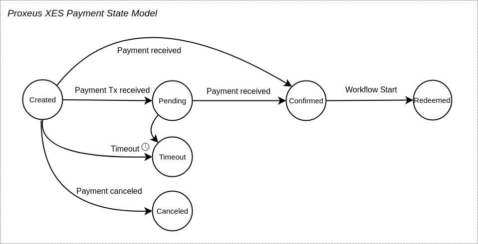
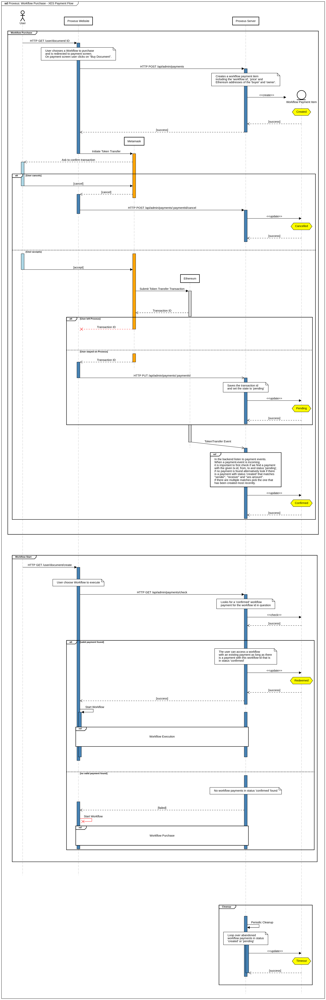

# XES Payment Specification

## Requirements
* The user pays for each start of a workflow (Exception: user is owner of the workflow or the workflow price is 0).
* The payment is made before the workflow is initiated (e.g. before the first form is displayed).
* A successful payment (confirmed transaction) starts the workflow. A failed transaction shows an error message on the payment page.
* Each workflow can have a different price. It is set in the workflow builder by the workflow owner and can be changed anytime.
* The default price is 0 XES. If the price is 0, the payment is skipped and the workflow starts right away. The price relevant for the workflow execution is the one that was valid at the time of transaction.
* The price is displayed where you choose the workflow to be started and on the payment page.

## Technical concept

### Outline
* A Workflow-Payments is an ERC-20 Transfer from the buying user's eth-address to the selling user's eth-address
* When a payment is submitted to the blockchain the platform-backend and the platform-frontend listens to the `Transfer`-Event, that is emitted by the blockchain as soon as the payment is confirmed.
* When the backend receives the event it persists the successful payment.
* When the frontend receives the event it sends a Request to the backend and redeems the payment by sending the transaction hash of the payment and workflowId of the workflow the user wants to start. In case the request fails the frontend retries the request multiple times.
* The backend checks for the validity of the transaction parameters. This check includes checking whether from-address, to-address and xes-amount match and that the payment has not been claimed before.
* The payment is redeemed as soon as the workflow is started.
* When a workflow is finished or has been deleted before finishing it and the user starts the same or any other workflow a new payment is due.

### State model

The following table shows the different states of a workflow payment:

State|Description
---|---
created|Initial state of a *new workflow payment*. <br>Used to capture payment intent for a specific workflow.<br><br>Attribute: <br>workflowId<br>from<br>to<br>price
pending|State indicating a *successful payment transaction submission* (payment not confirmed yet). <br>Used to associate payment transaction from the Blockchain event with a workflow purchase.<br><br>Attribute: <br>transcationId
confirmed|State indicating a *successfully completed payment transaction*. <br>
redeemed|State indicating the *use of a payment for a workflow execution*.<br>
timeout|State indicating either an *abandoned or unsuccessful payment attempt* that has timed out.<br>

The following diagram shows the state transitions of a workflow payment:



### Sequence Diagram


## Known Issues
Due to the distributed and shared nature of the blockchain, in case multiple Proxeus Platform instances would be running, all payments would be shared between these Proxeus Platform instances. Therefore in the rare case where the same buyer and seller (same eth-address in metamask) use various Platform instances it would be possible to pay for a workflow on one instance and use the workflow without payment on another instance. We mitigate the risk of exploiting this behaviour by checking the from-address, to-address and xes-amount in the backend of the Platform. Thanks to this measure the described issue could potentially only arise, in a scenario where the same buyer and same seller of a workflow would be registered on multiple Proxeus Platform Instances and buyer and seller would both have to be registered on 2 or more of the same Proxeus Platform Instances. In addition to that the price of the workflow would have to exactly match the price on the other instances.

## Payment tests
To run the tests locally:
```
make test-payment
```
Expected result:
```
  ok      git.proxeus.com/core/central/main/handlers/api          0.023s
  ok      git.proxeus.com/core/central/main/handlers/workflow     0.026s
  ok      git.proxeus.com/core/central/main/handlers/blockchain   0.025s
```
